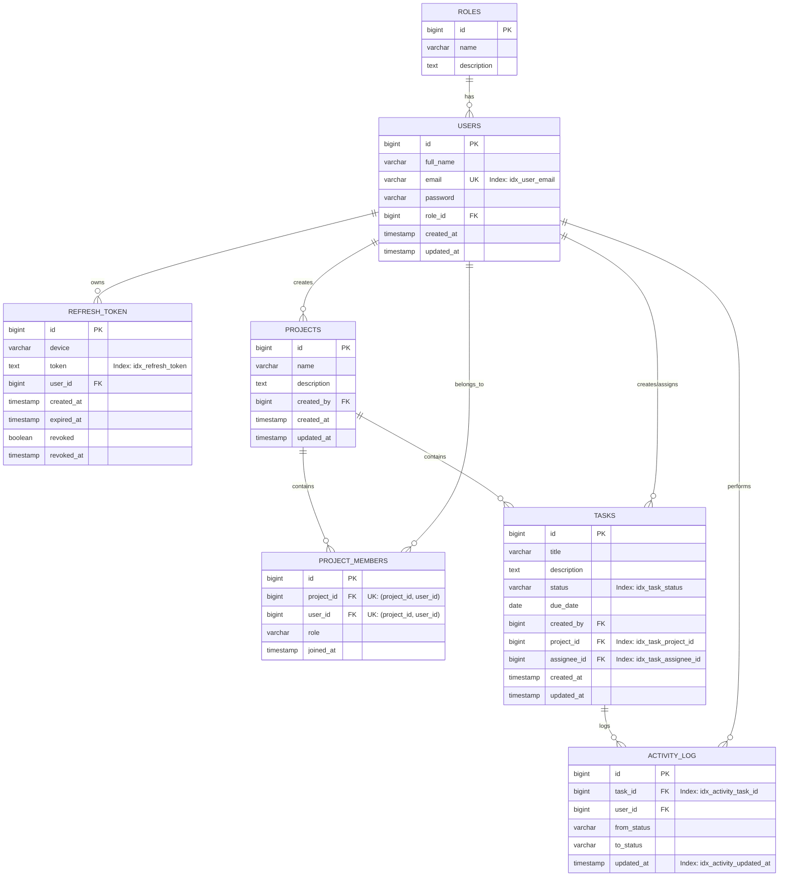

# Sơ Đồ ERD (Entity Relationship Diagram) - Task Management System

Below is the database schema ERD represented using Mermaid notation.

## Ghi chú về Chuẩn Hóa & Đánh Index
1. **Chuẩn hóa (3NF)**:
   - Các bảng tách biệt đúng thực thể, không lặp lại nhóm dữ liệu (1NF).
   - Mọi thuộc tính không khóa đều phụ thuộc hoàn toàn vào Khóa chính (2NF).
   - Không tồn tại phụ thuộc bắc cầu giữa các thuộc tính không khóa (3NF).
2. **Đánh Index**:
   - `users.email`: Tối ưu tìm kiếm và đăng nhập theo email (`idx_user_email`).
   - `refresh_token.token`: Tối ưu truy vấn xác thực token (`idx_refresh_token`).
   - `tasks.project_id`, `tasks.assignee_id`, `tasks.status`: Tối ưu truy vấn danh sách công việc và lọc theo dự án/trạng thái/người thực hiện.
   - `activityLog.task_id`, `activityLog.updatedAt`: Tối ưu xem nhật ký hoạt động theo công việc và thời gian.
   - `project_members.(project_id, user_id)`: Ràng buộc duy nhất & tự động tạo Composite Index giúp kiểm tra quyền nhanh chóng.
